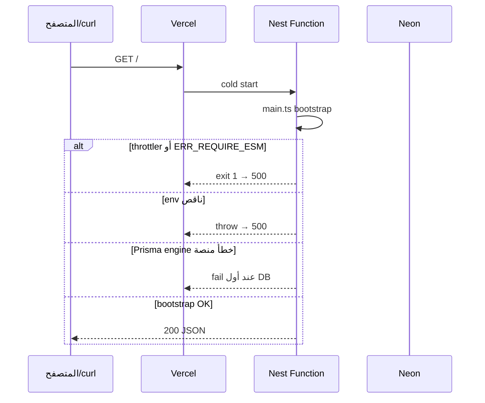

# إصلاح خطأ 500 على Vercel (NestJS Backend)

هذا المستند يشرح **ما الذي كان يحدث بالضبط** عند نشر مشروع `backend-nest` على Vercel، و**لماذا كان البناء ينجح بينما التطبيق يفشل وقت التشغيل**، و**ما الذي تم تغييره لإصلاح المشكلة**.

**الرابط الإنتاجي بعد الإصلاح:** `https://fullstack-e-commerce-beta.vercel.app`

---

## ملخص سريع

| المرحلة | ما الذي رأيناه |
|--------|----------------|
| **Build على Vercel** | غالباً **ناجح** (`npm ci` → `prisma generate` → `nest build`) |
| **Runtime (طلب HTTP)** | **500** مع `INTERNAL_FUNCTION_INVOCATION_FAILED` أو `FUNCTION_INVOCATION_FAILED` |
| **السبب الجذري** | عدة مشاكل تراكمت؛ أهمها: **تعارض ESM/CJS**، **فشل نشر بعض الـ commits**، **إعدادات Prisma/Node على بيئة Serverless**، و**متغيرات البيئة** |

لم تكن المشكلة خطأ TypeScript في الغالب، بل **تعطل عملية Node أثناء الإقلاع (bootstrap)** قبل أن يصل الطلب إلى `GET /`.

---

## كيف يعمل Nest على Vercel (سياق مهم)

Vercel يتعرف على Nest عبر نقطة الدخول `src/main.ts` ويشغّل التطبيق كـ **Vercel Function** (Fluid Compute). التطبيق يستدعي `app.listen(PORT)` كما في التطوير المحلي، لكن:

- ملف `.env` المحلي **لا يُرفع** إلى Git ولا يصل تلقائياً إلى Vercel.
- حزمة الإنتاج على Vercel **لا تتضمن `devDependencies`** (مهم لـ Prisma).
- بيئة التشغيل **Linux** (مثل `rhel-openssl-3.0.x`) وليست Windows — محرك Prisma يجب أن يُبنى للهدف الصحيح.
- NestJS 12 و `@nestjs/common` يعملان كـ **ESM** (`"type": "module"`)، بينما بعض الحزم القديمة ما زالت **CommonJS** وتستخدم `require()` — وهذا يسبب `ERR_REQUIRE_ESM`.

---

## المشاكل بالتفصيل (بالترتيب المنطقي)

### 1) خطأ `ERR_REQUIRE_ESM` — `@nestjs/throttler`

**الأعراض في Runtime Logs:**

```text
Error [ERR_REQUIRE_ESM]: require() of ES Module .../@nestjs/common/index.js
from .../@nestjs/throttler/dist/throttler.decorator.js not supported.
Node.js process exited with exit status: 1.
```

**السبب:**

- المشروع يستخدم Nest 12 مع **ESM**.
- `@nestjs/throttler` يُحمَّل كـ **CommonJS** ويحاول `require('@nestjs/common')` بينما `@nestjs/common` **ESM-only**.
- Node على Vercel يرفض هذا المزيج → العملية تنهار **قبل** أي route، حتى `GET /`.

**الحل:**

- إزالة `ThrottlerModule` و `ThrottlerGuard` من `AppModule`.
- إزالة `@nestjs/throttler` من `dependencies` في `package.json` حتى لا يدخل في bundle النشر.
- (اختياري لاحقاً) rate limiting من **Vercel Firewall** أو حل متوافق مع ESM.

---

### 2) فشل Build: `package-lock.json` غير متزامن مع `package.json`

**الأعراض:**

- Deploy معيّن (مثلاً بعد استبدال `bcrypt` بـ `bcryptjs`) يفشل عند `npm ci` برسالة أن الـ lockfile لا يطابق `package.json`.

**السبب:**

- تم تعديل `package.json` (حزم جديدة/محذوفة) دون تحديث `package-lock.json` بشكل صحيح.
- Vercel يستخدم **`npm ci`** وليس `npm install` — أي اختلاف = **فشل البناء**.

**النتيجة الخطيرة:**

- الإنتاج يبقى على **deploy قديم** بينما تعتقد أن آخر commit هو الم live.
- ظهرت أحياناً **500** أو **timeouts** لأن الإنتاج لم يكن يحمل إصلاحات throttler أو bcryptjs بعد.

**الحل:**

- تشغيل `npm install` محلياً وcommit لـ `package-lock.json` المحدّث (commit: `b68e4bd`).

---

### 3) `@prisma/client` في `devDependencies`

**السبب:**

- `PrismaService` يستورد `@prisma/client` في **كل تشغيل**.
- Vercel يثبت للإنتاج **`dependencies` فقط** → احتمال `Cannot find module '@prisma/client'` أو محرك Prisma ناقص.

**الحل:**

- نقل `@prisma/client` إلى **`dependencies`**.
- جعل **`build`**: `prisma generate && nest build` لضمان توليد العميل في CI.
- إزالة `postinstall` الخاطئ `prisma skills sync` (أمر غير موجود في Prisma 6.19 — كان يفشل ويُتجاهل بـ `|| exit 0`).

---

### 4) محرك Prisma على Linux (Serverless)

**السبب:**

- `prisma generate` على Windows يولّد محرك **Windows** افتراضياً.
- دالة Vercel تعمل على **Linux** (`rhel-openssl-3.0.x`) — بدون `binaryTargets` المناسب قد يفشل Prisma وقت أول استعلام أو أثناء تحميل العميل.

**الحل (في `prisma/schema.prisma`):**

```prisma
generator client {
  provider      = "prisma-client-js"
  binaryTargets = ["native", "rhel-openssl-3.0.x"]
}
```

---

### 5) إصدار Node على Vercel (24 vs 22)

**السبب:**

- Vercel قد يشغّل **Node 24** بينما Nest 12 + ESM + حزم CJS قديمة حساسة لتفاعلات `require(ESM)`.
- تم تثبيت **`"engines": { "node": "22.x" }`** في `package.json`.
- إضافة `.npmrc`:

```ini
node-options=--experimental-require-module
```

لتخفيف بعض حالات تحميل ESM من تبعيات CJS المتبقية.

---

### 6) إقلاع التطبيق (bootstrap) على Serverless

**تغييرات في `src/main.ts`:**

| التغيير | لماذا |
|--------|--------|
| `import 'reflect-metadata'` | مطلوب لـ decorators (ValidationPipe، JWT، إلخ) — Vercel يوصي به في أمثلة Nest |
| `assertRequiredEnv()` لـ `DATABASE_URL` و `JWT_SECRET` | فشل سريع وواضح بدل أخطاء غامضة |
| `parseCorsOrigins()` بدون `/` في نهاية الـ URL | `Origin` في المتصفح **بدون** slash أخير — CORS يفشل إن كان الـ env فيه slash |
| `app.listen(port, '0.0.0.0')` | الاستماع على كل الواجهات (مهم في حاويات/Vercel) |
| `PORT` الافتراضي `3000` (متوافق مع docs) | Vercel يمرّر `PORT`؛ الافتراضي للمحلي |
| `bootstrap().catch(...)` بدون top-level `await` | أقرب لنمط Vercel الرسمي لـ Nest |
| سجلات `[nest] bootstrap start` / `listening` | تتبع في Runtime Logs |

---

### 7) Prisma: عدم حظر الإقلاع بـ `$connect`

**السبب:**

- `onModuleInit` مع `$connect()` متكرر يزيد زمن cold start وقد يفشل الدالة على Serverless.

**الحل:**

- `PrismaService` extends `PrismaClient` **بدون** اتصال إجباري عند الإقلاع — الاتصال عند أول query (سلوك Prisma الافتراضي).

---

### 8) `bcrypt` الأصلي (native) مقابل `bcryptjs`

**السبب:**

- `bcrypt` native قد يسبب مشاكل على Serverless (بناء ثنائي، منصة مختلفة).

**الحل:**

- استخدام **`bcryptjs`** (JavaScript فقط) في `auth.service.ts`.

---

### 9) متغيرات البيئة على Vercel (ليست في Git)

**المطلوب في Vercel → Environment Variables (Production + Preview):**

| المتغير | الغرض |
|---------|--------|
| `DATABASE_URL` | Neon (مع `sslmode=require`) |
| `JWT_SECRET` | توقيع JWT |
| `CORS_ORIGIN` | أصول الفrontend مفصولة بفاصلة، **بدون** `/` في النهاية |

**الفرontend (مشروع منفصل):**

- `NEXT_PUBLIC_API_URL=https://fullstack-e-commerce-beta.vercel.app`

**أمان:** إن ظهرت credentials في محادثة أو logs — **غيّر كلمة مرور Neon و `JWT_SECRET`** ثم حدّث Vercel وأعد النشر.

---

## مخطط تدفق (ماذا كان يحدث عند 500)



---

## الملفات والـ commits المرجعية

| الموضوع | أين |
|---------|-----|
| دليل النشر المختصر (إنجليزي) | [`VERCEL.md`](VERCEL.md) |
| مثال env | [`.env.example`](.env.example) |
| إعداد Vercel | [`vercel.json`](vercel.json) |
| Prisma + build + Node | [`package.json`](package.json), [`prisma/schema.prisma`](prisma/schema.prisma) |
| نقطة الدخول | [`src/main.ts`](src/main.ts) |

Commits مهمة على `main` (تقريباً بالترتيب):

1. `bb28f4e` — Prisma في `dependencies`، `build` مع `prisma generate`، إزالة postinstall الخاطئ  
2. `11a86af` / `eb055ce` — إزالة throttler (ESM)  
3. `23aa88b` — Prisma lazy (بدون connect في الإقلاع)  
4. `615fe5f` / `b68e4bd` — bcryptjs + إصلاح lockfile  
5. `9a5d46b` — Node 22، `binaryTargets`، reflect-metadata، bootstrap، `.npmrc`

---

## التحقق بعد الإصلاح

```bash
curl https://fullstack-e-commerce-beta.vercel.app/
curl https://fullstack-e-commerce-beta.vercel.app/products
```

**المتوقع:** HTTP **200** — الأولى ترجع `Hello World!` (داخل غلاف الـ interceptor)، الثانية قائمة منتجات من PostgreSQL.

---

## دروس مستفادة (للمستقبل)

1. **Build ناجح ≠ Runtime ناجح** — راقب **Runtime Logs** وليس Build Logs فقط.  
2. على Vercel: **`npm ci`** يفرض lockfile متزامناً دائماً.  
3. أي حزمة تُستورد في runtime يجب أن تكون في **`dependencies`**.  
4. Nest 12 + ESM: تجنّب حزم CJS تستدعي Nest عبر `require`.  
5. Prisma على Serverless: **`binaryTargets`** لـ Linux + `prisma generate` في الـ build.  
6. ثبّت **Node** عبر `engines` إن ظهرت مشاكل توافق.  
7. **CORS** يجب أن يطابق `Origin` حرفياً (بدون slash زائد).

---

## إن عاد الخطأ 500

1. Vercel → **Deployments** → تأكد أن **Production** على آخر commit ناجح.  
2. **Logs → Runtime** — ابحث عن `ERR_REQUIRE_ESM`، `Missing required environment variable`، أو Prisma engine.  
3. تحقق من Environment Variables ثم **Redeploy**.  
4. بديل طويل الأمد: تشغيل API من [`Dockerfile`](Dockerfile) على Railway/Render/Fly وترك Vercel للـ frontend فقط.
